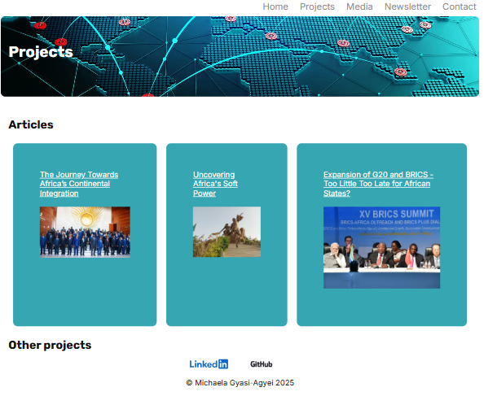
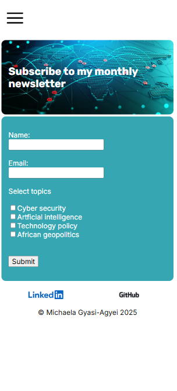

Michaela Gyasi-Agyei - Portfolio Task  

​
[My Portfolio](mikiashanti.github.io)
​
## Project Requirements

### Content
​
My portfolio site includes a profile picture, and a 100-word biography in the index page. I have included a contact form on the contact page, and a project section in the projects page. This page has separate sections for articles I have already published, and space to include my future coding projects. In the footer of each web page, I have included links to my LinkedIn profile, which is my preferred contact method, as well as my Github page. 

### Technical

I have five web pages in my portfolio: the index/home page, and projects, media, newsletter and contact pages. I have included a navigation bar for desktop and mobile versions of the website, which links to the projects, media, newsletter and contact pages. If the user is not currently on the home page, there is also an option to navigate back to this page. 

My portfolio has been version controlled with Git and deployed on GitHub pages. 

I have also implemented responsive design principles, including using flexbox to format my index, projects and media pages to appear differently on mobile and desktop. I have used semantic HTML to increase accessibility, including header, body, sections, nav and footer elements.

### Bonus
​
I have used different styles for hover states. When the buttons on my index page are in hover state, a shadow appears behind them. The articles on my index, media and projects pages change to a brighter tone when in hover state. 

I have used JavaScript for the hamburger menu on my site, so that the navigation options are revealed or hidden when the hamburger button is clicked.

### Screenshots
####  Index page on phone, ipad and laptop

####  Projects page on phone, ipad and laptop

####  Media page on phone, ipad and laptop

####  Newsletter page on phone, ipad and laptop

####  Contact page on phone, ipad and laptop

####  Hover states on button and article

